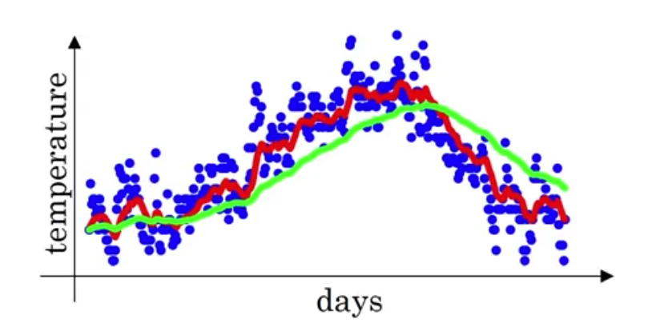

# Week 2

## Mini-batch gradient descent

* Gradient descent requires you to process your entire training dataset to make a step.
  * Mini-batch takes a portion of the dataset and runs forward/backprop on it.
  * Speeds up training time.

## Understanding mini-batch gradient descent

* The cost should decrease on every iteration of gradient descent.
  * Mini-batch would normally be more noisy but should trend downwards.
* Mini-batch parameter becomes a new parameter to choose.
  * When set to $m$, it's batch gradient descent (or just standard gradient descent).
  * When set to 1, it's considered "stochastic gradient descent".
* Stochastic gradient descent can be very noisy and won't ever converge.
* Mini-batch is somewhere in between 1 and $m$: optimal should work faster overall.
  * Batch gradient descent can be slow per iteration.
  * Stochastic is fast per iteration but can take longer to find a good result.
* Guidelines for choosing mini-batch size:
  * Use gradient descent if you have a small training dataset (< 2k).
  * Typical mini-batch sizes: 64 up to 512.
    * Code will sometimes run faster if mini-batch size if power of 2 (really tho?).
  * Want to make sure mini-batch fits in GPU/CPU memory.

## Exponentially weighted averages

* Aka exponentially weighted moving averages.
* If you had a bunch of variables that assigned a day to a temperature:
  ```
  day[1] = 4
  day[2] = 5
  ...
  day[180] = 29
  day[181] = 31
  ```
  * You could compute the moving average as follows:

  ```

  day[0] = 0
  day[1] = 0.9 * day[0] + 0.1 * day[1]
  day[2] = 0.9 * day[1] + 0.1 * day[2]
  ```
* General formula: $V_t = 0.9Vt-1 + 0.1\theta_t$ or in code:
  ```
  day[x] = 0.9 * day[x-1] + 0.1 * day[x]
  ```
* Even more generally: $V_t = \beta V_{t-1} + (1 - \beta)\theta_t$
  * In the above example we set beta as follows: $\beta = 0.9$
* Creates a line through the data that's much smoother but the curve shifts a bit to the right. So you have some latency when the weather changes:
  
  * The higher you set beta, the more latency you have and the more days you would be averaging over, in the example.

## Assignment Notes

* Difference between gradient descent, mini-batch gradient descent and stochastic gradient descent is the number of data examples required to take a step.
* Have a learning rate parameter that can be tuned.
* A well-tuned mini-batch performs better than gradient descent or stochastic gradient descent.

* Shuffling and partitioning are required for mini-batch implementations.
* Powers of 2 are usually chosen for mini-batch sizes.

* Momentum averages out gradients to smooth the gradient descent.
* Can tune momentum with beta hyperparam and the learning rate.
